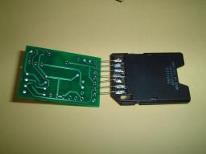

# 開発プロセスを振り返る (2007/09/02)

ソフトウェアやハードウェアの開発プロセスを外部から見ると、改善できる点が見つかります。このワークショップではワインバーグが書籍で紹介している演習をベースにして、自分の活動を振り返り、非効率なところに気づけることを目指します。

SWEST9では、以下のような順序で課題をおこないました。綱渡りだったものの、無事ワークショップをおこなうことができました。みなさん、ありがとうございました。

##  オープニング

ブラックボックス演習のハードウェアが4台しか用意できなかったのですが、議事録担当の方を含めて15人くらいだったので、幸運でした。

まず、簡単に分科会の説明をおこないました。参加者の方に机を動かしてもらい、4つの島を作りました。それぞれの島の近くにいた人で、チームを作りました。

##  ブラックボックス

> ブラックボックス演習のハードウェアの作り方は、 [SWEST9で使用したブラックボックス端末] で見ることができます。

ブラックボックス演習のハードウェアを、初期化して配布しました(作業用の集計用紙も配布しました)。このブラックボックスには4つの入力と4つの出力があります。入力は0〜99の範囲の数字、出力は-999〜+999の範囲の数字です。操作の方法を説明したあと、練習用の簡単なタイプで実際に操作してもらい、結果が得られたかどうかを確かめました。

続けて、この練習用の問題をチームで解いてもらいました。基本的には、何か入力を与え、その出力を観察し、内部を推測し、次の入力を計画する、という順序になります。確か30分くらいでどのチームも答えが得られたと記憶しています。

>  [web版ブラックボックス1] で、この演習が体験できます。

さて、練習の次は本番です。もう少し複雑なものに挑戦してもらいました。慣れてきているはずですが、それでも30分かかりました。ブラックボックスの性質上、正しい答えが得られたかどうかは確実にはわからないので、早めに結論が出たチームには確認を続けてもらいました。

>  [web版ブラックボックス2] で、この演習が体験できます。

最初に結論が出たチームに、推測した内容と、どういう過程で推測を進めたかを説明してもらい、他のチームからも意見をもらいました。

ブラックボックス演習はほかにも用意してあるのですが( [SWEST9のブラックボックス] )、意見を聞いた上で、次は間違い探しをおこなうことにしました。

##  間違い探し

間違い探しは、パズルの本などに良く出ていますが、これにチームで挑戦してもらいました。左右の図形が異なる箇所が、全部で14あり、これをすべて見つけてもらうのが課題です。

途中で各チームに進捗をたずねて、あとどれくらいかかるかを予想してもらいました。例えば、あるチームの結果は以下のようになりました。
|時間|見つけた数 / 残り時間の予想|
|---|---|
|3分後|8|
|5分後|13/あと5分|
|10分後|13|
|12分後|14(完了)|

30分たったところで打ち切り、以下のような議論をおこないました。
- 初期に見つかったもの、最後に見つかったもの
- もっと速く見つけるにはどうすればよいか
- 残り時間を予測するにはどうしたらよいか
- グラフ化して、バグ検出曲線としての考察

##  クロージング

最後に、全員に自己紹介してもらい、感想などを語ってもらいました。また、ブラックボックスにもっと挑戦したい人は、宴会場で対応することを伝えました。

##  (企画時のコンテンツ)

以下は、当初の企画時のコンテンツです。
-  [企画内容] 
-  [ブラックボックスを使用した演習] 

# 組み込み百物語2 (2007/04/16)

ソフトウェアやハードウェアの開発に関する経験を持ち寄り、ワーストプラクティスを共有しようという企画です。

> このコンテンツは準備中です。

# 組み込み百物語 (2007/04/16)

ソフトウェアやハードウェアの開発に関する経験を持ち寄り、ワーストプラクティスを共有しようという企画です。

> このコンテンツは準備中です。

# 開発プロセスを振り返る2 (2008/09/09)

ソフトウェアやハードウェアの開発プロセスを外部から見ると、改善できる点が見つかります。このワークショップではワインバーグが書籍で紹介している演習をベースにして、自分の活動を振り返り、非効率なところに気づけることを目指します。

SWEST10では、以下のような順序で課題をおこないました。コーディネーターの視点では今ひとつな印象だったのですが、感想を聞くといろいろ勉強になった点があったとのことで、これからもいろいろ挑戦していきたいと考えています。

##  オープニング

簡単に分科会の説明をおこなったあと、参加者に机を動かしてもらって5つの島を作りました。前回より人数が増えています。

また、記録と議論のためのノートを、チームに1冊ずつ配布しました。

##  ブラックボックス

> ブラックボックス演習のハードウェアの作り方は、 [SWEST9で使用したブラックボックス端末] で見ることができます。

まず、 [前回] と同様のブラックボックス演習をおこないました。最初に簡単な問題をおこない、操作に慣れてもらった後、普通の問題をおこないました。前回よりもチーム内の人数が増えているせいか、比較的スムースに進んだように思いました。

問題のパラメータは前回とは異なっていますが、 [SWEST9のブラックボックス] でweb上で体験することができます。

##  YYYY

続いて「YYYY」に進みました。「YYYY」はワインバーグの本で紹介されている演習で、今回はブラックボックスの端末を使用し、12桁の整数を入力すると点数が返る形で実現しました。

> YYYYは [SWEST10のブラックボックス] でweb上で体験することができます。

30分の予定だったのですが、最終的に20分延長しました。

##  間違い探し

[前回] と同じ間違い探しにも挑戦してもらったのですが、予想よりもずっと短時間で終わってしまいました。

##  クロージング

最後に、全員に自己紹介してもらい、感想などを語ってもらいました。また、ブラックボックスにもっと挑戦したい人は、宴会場で対応することを伝えました。

##  徹夜部屋

YYYYに挑戦する人が何人もいて、最終的にワークショップのときよりも1桁高いスコアを達成しました。

##  気づいた点など

人数が多い方がアイディアが出やすいせいか、前回と同じ問題であっても、今回の方がずっと短時間でできているように感じられました。人数が多いときは、多少難易度を高めにしてもよいのかも知れません。

YYYYは今回はじめてだったので、コーディネータも多少緊張してしまい、あまり踏み込んだテーマの提示ができなかったことが心残りです。

# 開発プロセスを振り返る3 (2009/09/03)

ソフトウェアやハードウェアの開発プロセスを外部から見ると、改善できる点が見つかります。このワークショップではワインバーグが書籍で紹介している演習をベースにして、自分の活動を振り返り、非効率なところに気づけることを目指します。

SWEST11では、以下のような順序で課題をおこないました。多少長引くとは思っていたのですが、実際は6時間弱もかかってしまったのが反省点です。

##  オープニング

今回は書記の方をいれて13人が参加しました。参加者に机を動かしてもらって3つの島を作りました。

また、記録と議論のためのノートとペンを、チームに1冊ずつ配布しました。

##  ブラックボックス

> ブラックボックス演習のハードウェアの作り方は、 [SWEST9で使用したブラックボックス端末] で見ることができます。

まず、 [前回] と同様のブラックボックス演習をおこないました。最初に簡単な問題をおこなったのは前回と同じですが、今回は2回目に制御変数を取り入れてみました。

問題のパラメータは前回とは異なっていますが、 [SWEST9のブラックボックス] の [むず2] でweb上で体験することができます。

制御変数の問題は非常に時間がかかりました。途中で各チームに今までにわかったことを発表してもらい、**「このあとの進め方で、最悪のやり方を考えてから、再開してください」**というヒントを出しました。

最終的に、1チームは正解、1チームは正解だが改善可能、1チームは回答が得られませんでした。

##  ピタゴラスイッチ

与えられた部品を使って装置を作り、これをドキュメントにして、他のチームに再現してもらうという演習です。ドキュメントには絵を入れてはならないという制約があります。

> 使用した部品などの詳細については、 [ピタゴラスイッチ] をご覧ください。

まず最初に部品を配布し、講師が簡単な装置を作ってデモします。今回は、以下のようなものを作りました。
- 鉛筆2本を目玉クリップAではさんで作った坂に、ビー玉Bを置くと、ビー球Bは重力で坂を転がる
- ビー玉Bは木片Cの狭い面に当たり、当たった面の反対の面に取り付けられた目玉クリップDが、次の木片Eの上部を押し、倒す
	- これをうまくおこなうには、木片Cを立て、下にキャップもしくは鉛筆を置くと、キャップが転がるため摩擦が減ってよい
- ドミノ倒しの要領で配置された木片E、F、G、H、I、Jが、順に倒れる
	- これをうまくおこなうには、木片IとJは、比較的近接して配置するとよい
- 木片Jが倒れると、以下の起き上がりこぼしのロックが外れて、旗が起き、動作は終了する
- 起き上がりこぼしは、以下の部品からなる
	- ロック: 目玉クリップK
	- 土台: 目玉クリップL、M
	- おもり: 消しゴムN、O
	- 棒: 鉛筆P
	- 旗: キャップQ
- 目玉クリップLとMに、消しゴムNとOがはさまれている
	- 目玉クリップの目玉部を、起き上がりこぼしの脚とする
	- 2つ並べて使うことで、2脚にして安定させる
	- 消しゴムNは目玉クリップLとMの両方にはさみ、消しゴムOはLだけにはさむとよい
- 目玉クリップLの目玉部に、鉛筆Pが差し込まれている
	- 目玉クリップLの両方の穴に通すと角度がうまくないため、片方の穴にだけ差し込むとよい
- 鉛筆Pの先にキャップQを差し込む
- 目玉クリップKを木片Jの脇に取り付け、その目玉部にキャップQが入るようにする
	- 目玉クリップKの高さは、木片Jが倒れたときに起き上がりこぼしが作動するように調整する
- 消しゴムRを、消しゴムN・Oが倒れる先に置き、衝撃をやわらげるとよい

デモは一瞬で終わるので、各チームに試作に入ってもらいます。

いくつかアイディアが出始めたところで、**「これを納期があるプロジェクトだと考えて、あと30分で設計をおこない、そのあと15分でドキュメントを書いてください」**と説明しました。30分たったところでノートとクリップボードを配りました。

1チームが5分ほど余分にかかったのですが、できたドキュメントをクリップボードにはさんで提出してもらい、装置をいったん分解して箱に戻してもらいました。ドキュメントを簡単に確認し、図が入っていないことをチェックしました。

次に、ドキュメントを別のチームに渡し、装置を再現してもらいました。

しばらくして、解読不能になったチームが出たので、**「質問がある場合は、紙に書いてもらえば、作ったチームに渡します」**と説明しました。

最終的に2時間以上かかって、全部のチームが完成しましたので、各チームに作ったものを披露してもらうことにしました。前で組み立てている間、ドキュメントを読み上げます。動作させたあと、作ったチームに「自分が作ったものと同じか」を聞き、違う点があれば修正してもらいました。

参加者の疲労が大きそうに見えたので、細かい議論は見送りました。

##  クロージング

全員に感想などを発表してもらい、机の配置を元に戻して、終了しました。

##  気づいた点など

時間の読みが甘く、深く議論できなかった点が心残りでしたが、参加者ごとにいろいろな感想があったので少し安心しました。今後に生かしたいと思います。

# 開発プロセスを振り返る4 (2010/09/06)

ソフトウェアやハードウェアの開発プロセスを外部から見ると、改善できる点が見つかります。このワークショップではワインバーグが書籍で紹介している演習をベースにして、自分の活動を振り返り、非効率なところに気づけることを目指します。

SWEST12では、ピタゴラスイッチに限定して課題ををこないました。

##  オープニング

今回は書記の方をいれて5人が参加しました。これを、過去のワークショップ経験者2名と、未経験者3名にチーム分けしました。

##  ピタゴラスイッチ

与えられた部品を使って装置を作り、これをドキュメントにして、他のチームに再現してもらうという演習です。ドキュメントには絵を入れてはならないという制約があります。

> 使用した部品などの詳細については、 [ピタゴラスイッチ] をご覧ください。

まず最初に部品を配布し、講師が簡単な装置を作ってデモします。

https://www.youtube.com/watch?v=QFG1AoKRU

デモは一瞬で終わるので、各チームに試作に入ってもらいます。そして、適当なところでまとめてもらい、完成形が動くようにします。ここまで、約1時間かかりました。

次に、ノートとクリップボードを配ります。作品の作り方を、文字だけで書いてもらいます。「表を使っていいか」という質問があったのですが、「電報で送れる範囲」としました。今回はこのプロセスに、両チームとも1時間以上かかりました。

そしてドキュメントを回収し、図が入っていないかを簡単にチェックし、相手のチームに渡します。片方のチームは30分かからずに完成できたのですが、もう1つのチームは1時間くらいかかりました。途中、「質問がある場合は、紙に書いてもらえば、作ったチームに渡します」と声をかけたのですが、両チームとも必要ありませんでした。

最後に、両チームを集めてディスカッションをおこない、作品を実演してもらいました。片方のチームはうまく再現できなかったので、制作チームが修正して動かしました。
https://www.youtube.com/watch?v=-QGF1AoKvRU

##  気づいた点など

実は今回は、ふとしたきっかけで「作った人と違う人が書いた方がいいですよ」とアドバイスしました。これが原因で、去年とくらべてドキュメンテーションに時間がかかりましたが、再現の方はスムースにいったのではないかと思いました。

# 開発プロセスを振り返る5 (2011/09/26)

ソフトウェアやハードウェアの開発プロセスを外部から見ると、改善できる点が見つかります。このワークショップではワインバーグが書籍で紹介している演習をベースにして、自分の活動を振り返り、非効率なところに気づけることを目指します。

SWEST13では、ピタゴラスイッチに限定して課題ををこないました。
https://www.youtube.com/watch?v=jENfVACZ-SE

今回は11人が参加しました。全員、初めての方だったので、3つにチーム分けしました。

与えられた部品を使って装置を作り、これをドキュメントにして、他のチームに再現してもらうという演習です。ドキュメントには絵を入れてはならないという制約があります。

> 使用した部品などの詳細については、 [ピタゴラスイッチ] をご覧ください。

まず最初に部品を配布し、各チームでどんなことができるかを評価してもらいます。

https://www.youtube.com/watch?v=QFG1AoKRU

適当なところでレポート用紙とクリップボードを配って、「次の30分をどう時間配分するか」という作戦を立ててもらいました。

いよいよ、作品を作り、その作り方を文字だけで書いてもらいます。25分経過時点で、時間が足りないようだったので、30分延長しました。約65分で、全チームがリリースにこぎつけました。

ドキュメントを別のチームに渡し、作品を再現してもらいました。約20分かかりました。その後、作品を動かしてもらいました。

最後に、全員でディスカッションをおこない、終了としました。

# ワインバーグのブラックボックス (2007/04/16)

ワインバーグの本で紹介されていた、演習用のブラックボックスをweb上に作成してみました。

このブラックボックスは、7つの数字を入力すると、それを変換して7つの数字を出力します。以下の書籍で紹介されていたものです。
- システムづくりの人間学 (共立出版 ISBN4-320-02281-5) p.235

演習では、このようなブラックボックスに対して最大100回の入力をおこない、どのようなルールで変換がおこなわれるかを推測します。ブラックボックスはほかにも何タイプかありますが、ここではタイプ4を紹介します。
-  [ブラックボックスを起動] 

[090903]追記: ブラックボックス演習は、以下で使用しました。
-  [開発プロセスを振り返る] 
-  [開発プロセスを振り返る2] 
-  [開発プロセスを振り返る3] 

# ワークショップ企画 (2007/04/16)

ワインバーグの本に紹介されていた演習をベースに、ワークショップを企画しています。この資料では、ワークショップの内容を検討しています。

##  概要

ソフトウェアやハードウェアの開発作業は、専門家以外の人は理解が難しく、また担当者も多忙なために振り返りの時間が取れないことが多いと思います。そこで開発作業そのものではなく、まったく異なる演習を通じて開発作業を振り返り、日々の実務に生かせる気づきを得てもらおうというのが本ワークショップの目的です。
- 対象者: 開発作業に関心がある人(開発者に限らない)
- 内容: チームで教材に取り組み、気づいた点などを発表する
- 時間: 2時間程度

##  教材候補

このワークショップの教材は、ワインバーグの本で紹介されていたものをベースにしていますが、実行可能なように手を入れています。

###  間違い探し

チームに2枚の絵を渡します。2枚の絵はほとんど同じですが、いくつか異なる個所があります。異なる個所を全部見つけるのが目的です。

いくつか間違いが見つかったところで「全部見つけるまでの残り時間」を見積もってもらいます。発見の簡単なものは最初に見つかるが、発見の難しいものは最後まで見つからない性質があるため、テストやデバッグの見積もりの難しさを体験することができます。

筆者が有志を集めておこなったときは、10分程度で16個が見つかりました。

###  ブラックボックス

チームに箱を与えます。箱の外部から入力を与えると、箱から出力が得られます。この出力を観察して、異なる入力を与えます。これを繰り返すことで、箱の内部を推測するのが目的です。

入力は全部で100回しかおこなえないため、出力を見て実験計画に反映させながら推測していく必要があります。

ブラックボックスは、ハードウェア的に実現する方法と、ソフトウェア的に実現する方法とがあります。ハードウェアによる方法は、箱の端子に測定器をつないで箱の中身を推測します。ソフトウェアによる方法は、プログラムに値を入力し、結果を見てアルゴリズムを推測します。以下は、ソフトウェアによる例です。
-  [ブラックボックスの例] 

筆者は、実施経験がありません。

###  性格タイプ

人にはさまざまな選好があるため、自分とは違う優先順位で考えることがあります。違うタイプの人がいるということを知ることで、理解できないような言動があった場合でも、その人の考え方の上では最善を尽くしている、という理解を助けるのが目的です。

性格タイプはプライバシーと考えられますので、ワークショップでおこなう場合は注意が必要です。例えば、あらかじめ本人に同意を取った上で、代表的な性格タイプの人にパネラーになってもらう方法が考えられます。性格タイプ同士の典型的な衝突について、どういう選好でそういう言動に至ったのかを説明してもらうことで、自分とは違う考え方の人を理解するきっかけにできるのではないかと思います。

筆者が有志で性格タイプの紹介をおこなったときは、はっきり特徴が出る人と、そうでない人とがいたこともあり、特別な変化はおこせなかったように感じています。しかし、知人が特定の性格タイプであることを知っているときに、その人と似ている性格タイプの人の言動を説明してもらい、理解が深まったことはありました。

###  YYYY

ブラックボックスに似ているのですが、これは文字列を入力すると、点数が返ります。点数が高くなるような文字列を見つけるのが目的です。

このブラックボックスには仕掛けがあり、例えば「YYYY」が含まれる文字列はある程度高い点数が得られます。これを見つけたチームは、「YYYY」以外の入力を試すことが難しくなり、それ以上高い点数を出すことができなくなります。特定のやり方につかまった感じを経験することができます。

筆者は、実施経験がありません。

###  あいまいさの評価

仕様書などには、あいまいさが存在します。これは、お互いの暗黙の知識を前提としてコミュニケーションがおこなわれることによるものです。ワインバーグの本では、実施に必要な金額の見積もりを一人一人がおこない、そのバラツキを見ることで、あいまいさを評価する方法(あいまいさ投票)が紹介されています。

筆者は料理の経験が皆無なのですが、料理の本にも暗黙の前提がいくつもあります。料理の経験が多い人と少ない人とでチームを作り、あいまいな点を見つけて報告してもらうことで、一方が明確だと感じることでも、他者にはあいまいに見えるものがあるということを経験できるのではないかと考えました。

あいまいさの評価についても、筆者は実施経験がありません。

##  タイムテーブル案

勝手がわからないので、1教材につき30分を見込んでみました。時間が余れば質疑応答を増やしたり、人気の高い演習をもう一度おこなったりといった方法も考えられます。
|教材|時間|作業内容|
|---|---|---|
|(オープニング)| 5分|ワークショップの説明|
|| 5分|チーム分け|
|間違い探し| 5分|セッティング・教材の説明|
|| 15分|演習|
|| 10分|質疑応答|
|YYYY| 5分|セッティング・教材の説明|
|| 15分|演習|
|| 10分|質疑応答|
|ブラックボックス| 5分|セッティング・教材の説明|
|| 15分|演習|
|| 10分|質疑応答|
|(クロージング)| 15分|質疑応答|
|| 5分|アンケート実施|
|合計| 120分|　|

##  Todo
- プロモーション
	- (進行中)メルマガ(swest-discuss)
	- (進行中)webページ
- SWEST事務局との打ち合わせ
	- 紹介文の作成
	- 発表の申し込み
- 運営計画の立案
	- 人数の把握(参加申し込み時のアンケート依頼など)
	- スタッフの手配
	- 教材内容の決定
	- スケジュールの作成
	- プロジェクタなどの手配
- 教材の作成
	- 配布資料
	- ハードウェア

##  参考文献

# ワークショップ企画 (2007/04/26)

ワインバーグの本に紹介されていた演習をベースに、ワークショップを企画しています。この資料では、ワークショップの内容を検討しています。

以下の内容を更新しました。
- 「意思決定のプロセス」を追加
- 「隠れた意図のある会議」を追加
- 参考文献を追加

##  概要

ソフトウェアやハードウェアの開発作業は、専門家以外の人は理解が難しく、また担当者も多忙なために振り返りの時間が取れないことが多いと思います。そこで開発作業そのものではなく、まったく異なる演習を通じて開発作業を振り返り、日々の実務に生かせる気づきを得てもらおうというのが本ワークショップの目的です。
- 対象者: 開発作業に関心がある人(開発者に限らない)
- 内容: チームで教材に取り組み、気づいた点などを発表する
- 時間: 2時間程度

##  教材候補

このワークショップの教材は、ワインバーグの本で紹介されていたものをベースにしていますが、実行可能なように手を入れています。

###  間違い探し

チームに2枚の絵を渡します。2枚の絵はほとんど同じですが、いくつか異なる個所があります。異なる個所を全部見つけるのが目的です。

いくつか間違いが見つかったところで「全部見つけるまでの残り時間」を見積もってもらいます。発見の簡単なものは最初に見つかるが、発見の難しいものは最後まで見つからない性質があるため、テストやデバッグの見積もりの難しさを体験することができます。

筆者が有志を集めておこなったときは、10分程度で16個が見つかりました。

###  ブラックボックス

チームに箱を与えます。箱の外部から入力を与えると、箱から出力が得られます。この出力を観察して、異なる入力を与えます。これを繰り返すことで、箱の内部を推測するのが目的です。

入力は全部で100回しかおこなえないため、出力を見て実験計画に反映させながら推測していく必要があります。

ブラックボックスは、ハードウェア的に実現する方法と、ソフトウェア的に実現する方法とがあります。ハードウェアによる方法は、箱の端子に測定器をつないで箱の中身を推測します。ソフトウェアによる方法は、プログラムに値を入力し、結果を見てアルゴリズムを推測します。以下は、ソフトウェアによる例です。
-  [ブラックボックスの例] 

筆者は、実施経験がありません。

###  性格タイプ

人にはさまざまな選好があるため、自分とは違う優先順位で考えることがあります。違うタイプの人がいるということを知ることで、理解できないような言動があった場合でも、その人の考え方の上では最善を尽くしている、という理解を助けるのが目的です。

性格タイプはプライバシーと考えられますので、ワークショップでおこなう場合は注意が必要です。例えば、あらかじめ本人に同意を取った上で、代表的な性格タイプの人にパネラーになってもらう方法が考えられます。性格タイプ同士の典型的な衝突について、どういう選好でそういう言動に至ったのかを説明してもらうことで、自分とは違う考え方の人を理解するきっかけにできるのではないかと思います。

筆者が有志で性格タイプの紹介をおこなったときは、はっきり特徴が出る人と、そうでない人とがいたこともあり、特別な変化はおこせなかったように感じています。しかし、知人が特定の性格タイプであることを知っているときに、その人と似ている性格タイプの人の言動を説明してもらい、理解が深まったことはありました。

###  YYYY

ブラックボックスに似ているのですが、これは文字列を入力すると、点数が返ります。点数が高くなるような文字列を見つけるのが目的です。

このブラックボックスには仕掛けがあり、例えば「YYYY」が含まれる文字列はある程度高い点数が得られます。これを見つけたチームは、「YYYY」以外の入力を試すことが難しくなり、それ以上高い点数を出すことができなくなります。特定のやり方につかまった感じを経験することができます。

筆者は、実施経験がありません。

###  あいまいさの評価

仕様書などには、あいまいさが存在します。これは、お互いの暗黙の知識を前提としてコミュニケーションがおこなわれることによるものです。ワインバーグの本では、実施に必要な金額の見積もりを一人一人がおこない、そのバラツキを見ることで、あいまいさを評価する方法(あいまいさ投票)が紹介されています。

筆者は料理の経験が皆無なのですが、料理の本にも暗黙の前提がいくつもあります。料理の経験が多い人と少ない人とでチームを作り、あいまいな点を見つけて報告してもらうことで、一方が明確だと感じることでも、他者にはあいまいに見えるものがあるということを経験できるのではないかと考えました。

あいまいさの評価についても、筆者は実施経験がありません。

###  意思決定のプロセス

集団による意思決定には、以下のような方法があります。これらを実際に体験し、長所・短所を学ぶ演習です。ワインバーグの本では、ギネスブックに載っているさまざまなものの長さを10件程度取り上げ、それを長い順に並べるという課題が紹介されています。
- 投票
- 強いリーダー
- コンセンサス

投票は、参加者のそれぞれの判断を機械的に集計して、全体の判断とする方法です。公平ですが、意思決定の品質は高くありません。

強いリーダーは、1人のリーダーがそれぞれの参加者と個別に議論をおこない、リーダーが判断を下すというものです。参加者間で情報が共有されないという弱点があります。

コンセンサスは、全員が何らかの形で結論に貢献する、という方法です。チームがうまくまとまっており、時間もある場合には、高い品質が得られるとのことです。

筆者はカラオケボックスを使ってやろうと考えたことはありますが、実際に実施したことはありません。

> 入社試験でこのタイプの演習をおこなった例が、以下に紹介されています。「月をなめるな」で有名なコンテンツです。

>  http://web.kyoto-inet.or.jp/people/ray_fyk/diary/dr0010_3.htm#001026

###  隠れた意図のある会議

会議において、以下のような隠れた課題を個人に与え、どういう意図がどういう行動を引き起こすのかを体験するという演習です。
- 全員に発言の機会があるようにしてください
- 会議の結論がXになるように努力してください(ただし、それがあなたの仕業だと思われないようにしてください)
- このあとに予定に出席したいという気持ちになり、この会議を早く終わらせるようにしてください
- このあとの予定に欠席したいという気持ちになり、この会議で長引かせるようにしてください

これも、筆者は実施経験がありません。

##  タイムテーブル案

勝手がわからないので、1教材につき30分を見込んでみました。時間が余れば質疑応答を増やしたり、人気の高い演習をもう一度おこなったりといった方法も考えられます。
|教材|時間|作業内容|
|---|---|---|
|(オープニング)| 5分|ワークショップの説明|
|| 5分|チーム分け|
|間違い探し| 5分|セッティング・教材の説明|
|| 15分|演習|
|| 10分|質疑応答|
|YYYY| 5分|セッティング・教材の説明|
|| 15分|演習|
|| 10分|質疑応答|
|ブラックボックス| 5分|セッティング・教材の説明|
|| 15分|演習|
|| 10分|質疑応答|
|(クロージング)| 15分|質疑応答|
|| 5分|アンケート実施|
|合計| 120分|　|

##  Todo
- プロモーション
	- (進行中)メルマガ(swest-discuss)
	- (進行中)webページ
- SWEST事務局との打ち合わせ
	- 紹介文の作成
	- ( [申込済み] )発表の申し込み
- 運営計画の立案
	- 人数の把握(参加申し込み時のアンケート依頼など)
	- スタッフの手配
	- 教材内容の決定
	- スケジュールの作成
	- プロジェクタなどの手配
- 教材の作成
	- 配布資料
	- ハードウェア

##  参考文献
- 要求仕様の探検学(共立出版)

> あいまいさ投票が紹介されています。
- システムづくりの人間学(共立出版)

> ブラックボックス演習が紹介されています。
- スーパーエンジニアへの道(共立出版)

> YYYYの演習、チームによる意思決定の演習が紹介されています。
- コンサルタントの道具箱

> 隠れた意図のある会議(索引では「隠れた意図」)が紹介されています。
- ワインバーグのシステム思考法(共立出版)

> 間違い探しの演習が紹介されています。
- ワインバーグのシステム行動法(共立出版)

> 性格タイプの1つであるMBTIが紹介されています。

# SWEST9のブラックボックス (2007/09/02)

SWEST9の分科会で使用した演習用のブラックボックスをweb上に作成しました。

このブラックボックスは、4つの数字を入力すると、それを変換して4つの数字を出力します。以下の書籍を参考にしました。
- システムづくりの人間学 (共立出版 ISBN4-320-02281-5) p.235

このブラックボックスは、以下の仕様になっています。
- 入力は4つで、それぞれ0〜99の範囲の数字です。
- 出力は4つで、それぞれ-999〜+999の範囲の数字です。
- 入力は50回まで可能です(これはweb版では実装されていません)。

全部で5種類用意しましたが、演習で使用したのは最初の2種類です。
-  [やさしい] 
-  [ふつう] 
-  [むず1] 
-  [むず2] 
-  [むず3] 

[090903]追記: ブラックボックス演習は、以下で使用しました。
-  [開発プロセスを振り返る] 
-  [開発プロセスを振り返る2] 
-  [開発プロセスを振り返る3] 

# SWEST9で使用したブラックボックス端末 (2007/09/20)

SWEST9の分科会で使用した、演習用のブラックボックス端末の設計データです。

##  概要

このハードウェアは、テンキーと液晶を備えており、入力したデータに演算をおこなって表示するようになっています。これを利用して、ブラックボックスの演習をおこなうことができます。

web上でこのアルゴリズムを再現したものが、 [SWEST9のブラックボックス] のページで体験できます。

##  製造マニュアル
- データ一式ダウンロード: [bb070919.lzh] 
	- プリント基板のガーバーデータ
	- PICのソースコード
	- 写真・図版

本ドキュメントは含まれていませんので、このページを印刷するか保存してください。

なお、現バージョンのプリント基板(BB070902-A)の左下には、不要なビアがあります。これは筆者の設計ミスで、最初は抵抗が入っていました。ユニバーサル基板のときに抵抗をつけて動作確認をおこない、そのまま基板を製造してしまったのですが、実際にはこの抵抗は必要ありません。そこでデータに最低限の修正を加えて、ジャンパーにしてあります。もっときれいなデータも準備できていますので、製造して動作を確認できしだい公開する予定です。

###  完成見本
	() ---- SWEST9で使用

###  回路図・部品表
|種類|品番|数量|備考|
|---|---|---|---|
|IC|PIC16F648A|1||
|LCD|SD1602HULB-XA|1|SC1602BS-B等でも可|
|D|1S1588|2|または相当品|
|R|47Ω|1||
||1kΩ|4||
|C|0.1μF|3||
|SW|タクトスイッチ|18||
|その他|18ピンICソケット|1||
||ピンソケット|1|LCD接続用|
||ピンヘッダ|1|LCD接続用|
||電池ボックス|1||
||CR2032|1||
||基板|1|下記の基板またはユニバーサル基板|
||A-one 31031|1|キーパッド用フィルム|
||ゴム足|4||

LCDモジュールは5V駆動なので、PICのクロック出力を倍電圧整流して約4.5Vにしています。この電圧だと、特にコントラスト調整も必要ないようです。

回路上はスキャン線がフローティングになりますが、ソフトウェアでフローティング状態が続かないようにし、特にハードウェアでの対策はおこなっていません。気になる方は、スキャン線をプルアップしてください。

###  基板

電池ボックス・LCDモジュールは、それぞれ2種類のタイプに対応しています。
-  [プリント基板PDF]  (ガーバーデータは [bb070919.lzh] に含まれています)

ユニバーサル基板で作る場合は、以下の写真を参考にしてください。

###  マイコン

ソースコードは [bb070919.lzh] に含まれています。PIC-STARTなどでマイコンに書き込んでください。

PIC16F648Aは秋月電子通商などで入手できます。3Vで駆動でき、クロック内蔵です。全体の消費電流は実測で2mAほどでしたので、200mAhのCR2032で100時間程度駆動できることになります。

###  キーパッド

レーザープリンタ対応の白色フィルムのラベルに、以下のPDFを印刷して、切り取って貼り付けてください。表面のかすれが気になる場合は、この上に透明なフィルムを貼ってしまうのもよいと思います。
-  [キーパッドPDF]  ---- 写真のものとは少し異なります。

最初はフィルムのねじれを心配して縦一列に切っていましたが、特に気にしなくても良いようです。

##  ユーザーズマニュアル

以下は、操作方法の説明です。

###  リセット

電池を入れると、以下の画面が表示されます。
	Menu code:_

「1147」と入力します(これは起動パスワードです)。以下の画面が表示されます。
	Press Enter key
	(Long)

ワークショップの場合は、ここで参加者にブラックボックス端末を渡すとよいと思います。

###  教材の選択

どの状態でも、Enterキーを3秒以上押すと、「教材の選択」の画面になります。
	Menu code:_
- 起動パスワードの画面と同じですが、Clearキーを押すと元の画面に戻ります。

4桁の教材番号を入力します。
- 「3922」を入力すると、教材「やさしい」が実行されます。
- 「0647」を入力すると、教材「ふつう」が実行されます。
- 「9423」を入力すると、教材「むず1」が実行されます。
- 「2711」を入力すると、教材「むず2」が実行されます。
- 「3235」を入力すると、教材「むず3」が実行されます。
- 起動パスワード「1147」を入力すると、教材の実行カウントがクリアされ、さらに50回入力できるようになります。

###  数値の入力

教材を選択すると、以下の画面になります。
	(-49)Input
	00 00 00 00 Ok
-「-49」は、入力できる残りの回数を示しています。0番まで入力することができますので、あと50回入力できます。回数は、教材ごとに独立してカウントされます。

2桁の数値を4組入力します。
- テンキーを押すと、カーソル位置に数字が入力され、カーソルが右に移動します。
- ←→でカーソルを動かすことができます。
- ↑は、直前に実行した結果の画面に戻ります(1回目のときは、常に0が表示されます)。
- 「Ok」にカーソルを合わせてEnterキーを押すと、入力した数値で計算がおこなわれ、「結果の確認」に進みます。

###  結果の確認

計算がおこなわれると、次の画面になります。
	(-49)01 02 03 04
	+002+005-002+001
- 「-49」は、入力したときの番号です。
- 「01 02 03 04」入力した数値がそのまま表示されます。
- 「+002+005-002+001」は、2、5、-2、1の組が計算結果であることを示しています。

古い計算結果を呼び出すことはできないので、ノートなどにメモした上で、次の数字を入力していきます。
- ↓は、数値の入力画面に進みます。ただし、すでに50回入力してしまった場合は、それ以上入力できません(番号が「0」になります)。

# SWEST9で使用したブラックボックス端末 (2007/10/29)

SWEST9の分科会で使用した、演習用のブラックボックス端末の設計データです。プリント基板の無駄な部分を修正しました。

##  概要

このハードウェアは、テンキーと液晶を備えており、入力したデータに演算をおこなって表示するようになっています。これを利用して、ブラックボックスの演習をおこなうことができます。SWEST9の [開発プロセスを振り返る] で、この端末を利用したワークショップをおこないました。

web上でこのアルゴリズムを再現したものが、 [SWEST9のブラックボックス] のページで体験できます。

##  製造マニュアル
- データ一式ダウンロード: [bb071029.lzh] 
	- プリント基板のガーバーデータ
	- PICのソースコード
	- 写真・図版

本ドキュメントは含まれていませんので、このページを印刷するか保存してください。

###  完成見本
	() ---- SWEST9で使用

	() ---- 古い基板データです

	() ---- 古い基板データです

	() ---- 基板左下のジャンパーが修正されています。

###  回路図・部品表
|種類|品番|数量|備考|
|---|---|---|---|
|IC|PIC16F648A|1||
|LCD|SD1602HULB-XA|1|SC1602BS-B等でも可|
|D|1S1588|2|または相当品|
|R|47Ω|1||
||1kΩ|4||
|C|0.1μF|3||
|SW|タクトスイッチ|18||
|その他|18ピンICソケット|1||
||ピンソケット|1|LCD接続用|
||ピンヘッダ|1|LCD接続用|
||電池ボックス|1||
||CR2032|1||
||基板|1|下記の基板またはユニバーサル基板|
||A-one 31031|1|キーパッド用フィルム|
||ゴム足|4||

LCDモジュールは5V駆動なので、PICのクロック出力を倍電圧整流して約4.5Vにしています。この電圧だと、特にコントラスト調整も必要ないようです。

回路上はスキャン線がフローティングになりますが、ソフトウェアでフローティング状態が続かないようにし、特にハードウェアでの対策はおこなっていません。気になる方は、スキャン線をプルアップしてください。

###  基板

電池ボックス・LCDモジュールは、それぞれ2種類のタイプに対応しています。
-  [プリント基板PDF]  (ガーバーデータは [bb071029.lzh] に含まれています)

ユニバーサル基板で作る場合は、以下の写真を参考にしてください。

###  マイコン

ソースコードは [bb071029.lzh] に含まれています。PIC-STARTなどでマイコンに書き込んでください。

PIC16F648Aは秋月電子通商などで入手できます。3Vで駆動でき、クロック内蔵です。全体の消費電流は実測で2mAほどでしたので、200mAhのCR2032で100時間程度駆動できることになります。

###  キーパッド

レーザープリンタ対応の白色フィルムのラベルに、以下のPDFを印刷して、切り取って貼り付けてください。表面のかすれが気になる場合は、この上に透明なフィルムを貼ってしまうのもよいと思います。
-  [キーパッドPDF]  ---- 写真のものとは少し異なります。

最初はフィルムのねじれを心配して縦一列に切っていましたが、特に気にしなくても良いようです。
	() ---- 古い基板データです

##  ユーザーズマニュアル

以下は、操作方法の説明です。

###  リセット

電池を入れると、以下の画面が表示されます。
	Menu code:_

「1147」と入力します(これは起動パスワードです)。以下の画面が表示されます。
	Press Enter key
	(Long)

ワークショップの場合は、ここで参加者にブラックボックス端末を渡すとよいと思います。

###  教材の選択

どの状態でも、Enterキーを3秒以上押すと、「教材の選択」の画面になります。
	Menu code:_
- 起動パスワードの画面と同じですが、Clearキーを押すと元の画面に戻ります。

4桁の教材番号を入力します。
- 「3922」を入力すると、教材「やさしい」が実行されます。
- 「0647」を入力すると、教材「ふつう」が実行されます。
- 「9423」を入力すると、教材「むず1」が実行されます。
- 「2711」を入力すると、教材「むず2」が実行されます。
- 「3235」を入力すると、教材「むず3」が実行されます。
- 起動パスワード「1147」を入力すると、教材の実行カウントがクリアされ、さらに50回入力できるようになります。

###  数値の入力

教材を選択すると、以下の画面になります。
	(-49)Input
	00 00 00 00 Ok
-「-49」は、入力できる残りの回数を示しています。0番まで入力することができますので、あと50回入力できます。回数は、教材ごとに独立してカウントされます。

2桁の数値を4組入力します。
- テンキーを押すと、カーソル位置に数字が入力され、カーソルが右に移動します。
- ←→でカーソルを動かすことができます。
- ↑は、直前に実行した結果の画面に戻ります(1回目のときは、常に0が表示されます)。
- 「Ok」にカーソルを合わせてEnterキーを押すと、入力した数値で計算がおこなわれ、「結果の確認」に進みます。

###  結果の確認

計算がおこなわれると、次の画面になります。
	(-49)01 02 03 04
	+002+005-002+001
- 「-49」は、入力したときの番号です。
- 「01 02 03 04」入力した数値がそのまま表示されます。
- 「+002+005-002+001」は、2、5、-2、1の組が計算結果であることを示しています。

古い計算結果を呼び出すことはできないので、ノートなどにメモした上で、次の数字を入力していきます。
- ↓は、数値の入力画面に進みます。ただし、すでに50回入力してしまった場合は、それ以上入力できません(番号が「0」になります)。

##  関連項目

[090903]追記: ブラックボックス演習は、以下で使用しました。
-  [開発プロセスを振り返る] 
-  [開発プロセスを振り返る2] 
-  [開発プロセスを振り返る3] 

# GPSデータロガーの解析 (2008/02/27)

GPSデータロガーのデータ解析用PHPのデモです。
-  [起動する] 
	-  [ソースの表示] 
	-  [ダウンロード] 
-  [GPSデータロガーのドキュメント] 

# SWEST10のブラックボックス (2008/09/09)

SWEST10の分科会で使用した演習用のブラックボックスをweb上に作成しました。

このブラックボックスは、前回のもの( [SWEST9のブラックボックス] )に加え、12桁の数値を入力するとスコアが表示されるプログラムを用意しました。以下の書籍を参考にしました。
- スーパーエンジニアへの道 (共立出版 ISBN4-320-02563-6) p.264

演習ではチームで入力する値を考え、制限時間内でできるだけ高いスコアを得られるように試行錯誤します。なお、入力回数は無制限です。

web版が、以下で体験できます。
-  [yyyy] 

[090903]追記: ブラックボックス演習は、以下で使用しました。
-  [開発プロセスを振り返る] 
-  [開発プロセスを振り返る2] 
-  [開発プロセスを振り返る3] 

# DJ用CDプレーヤー(PDF) (2009/05/07)

swest10でデモしたDJ用CDプレーヤーの、解説資料をダウンロードできます。

別のイベントで配布した資料のPDFを、以下に用意しました。内容がまだ少ないので、今後充実させていこうと考えています。
-  [cdjpam0.pdf] 

大変お待たせして申し訳ありません。

[090903]画面に縞模様が出ることがありますが、この場合はAcrobat Readerの編集メニューの環境設定で「画像のスムージング」をOFFにしてください。

# ピタゴラスイッチ (2009/09/03)

SWEST11の分科会で使用した演習用セットを紹介します。

正確には「ピタゴラスイッチ」というテレビ番組の1コーナーとして「ピタゴラ装置」があるのですが、ここでは知名度が高いので「ピタゴラスイッチ」と呼んでいます。ドミノ倒しのように、最初に小さなアクションを起こすと、別の部品に動きが伝わっていき、最後に大きなアクションが起こるというものです。

以下の書籍の演習を実現しようとしていろいろ悩んだのですが、最終的にピタゴラスイッチを作るという形を思いつきました。
- スーパーエンジニアへの道 (共立出版 ISBN4-320-02563-6) p.133

まず各チームに、以下のセットが配られます。
- 木片 ×16 (ジェンガ)
- 鉛筆 ×12
- 目玉クリップ ×10 (透けるトンCLIP  http://www.velos.co.jp/sub9500-skc22cy.html )
- 鉛筆のキャップ ×8 (内1つは旗がついている)
- キーリング ×6
- ビー玉 ×4
- 消しゴム ×4
- 定規(20cm)
- これらを入れる箱

チームは、これを使ってピタゴラスイッチを作ります。

完了すると、以下のものが配られます。
- ノート
- クリップボード
- ペン

チームは、装置の作り方をノートに書いてドキュメントとし、クリップボードにとめます。ただし、ドキュメントに絵を含めることはできません。

ドキュメントを回収し、いったん装置を分解してもらったあと、他のチームにドキュメントを渡して装置を再現してもらいます。

ドキュメントでわからない点がある場合は、ノートに書いてもらえば、講師が作ったチームに渡して回答をもらうことができる、としました。

この演習は、以下で使用しました。
-  [開発プロセスを振り返る3] 
-  [開発プロセスを振り返る4]  (動画あり)

# GPSデータロガー (2008/02/28)

模型ロケットに搭載可能で、保守の容易な、GPSによる位置記録システムの開発をおこないました。

##  ダウンロード
- マニュアルを含む全データ:  [gl080227.tgz] 
	- プリント基板データのみ:  [gl050617.lzh] 
	- PICソースのみ:  [gpslog3.src] 

以下のコンテンツは、SWEST7で印刷配布したドキュメントを、このサイト用にフォーマット変換したものです。

#  GPSロガー オペレーションマニュアル

##  システムの概要

このGPSロガーは、モデルロケットに搭載され、GPSによってモデルロケットの三次元の飛行経路を観測・記録します。GPSロガーは、以下の3つの部分から構成されています。

観測記録部は、モデルロケットに搭載する部分です。防水のためのフィルムケースに格納され、GPSから受信したデータをメモリカードに記録します。

充電部は、観測記録部のバッテリーを充電する部分です。交流100Vの電源を使用して、8時間のタイマーによりバッテリーを充電します。

解析表示部は、観測記録部によって記録されたメモリカードのデータを解析し、画面に表示する部分です。この部分はサーバソフトウェアとして提供され、ユーザーのPCからネットワーク経由でアクセスします。なお、サーバソフトウェアをユーザーのPC上にインストールし、スタンドアローンで動作させることも可能です。

###  観測記録部の仕様
|観測方法|12チャンネルGPS|
|観測データ|緯度、経度、高度、衛星捕捉数、時刻|
|準備時間|最大10分|
|記録媒体|mini-SDカード(付属) 10分版×1、1時間版×1|
|記録形式|FAT16(制限あり)|
|記録間隔|1秒ごと|
|入出力|メモリカードスロット×1、LED×1、充電/テスト用コネクタ×1|
|電源|内蔵バッテリー(3.6V 70mAh)|
|動作時間|20分(準備時間を含む)|
|形状|直径33mm×高さ53mmの円筒形|
|重量|35g(メモリカードを含む)|

###  充電部の仕様
|電源|交流100V|
|充電時間|8時間(0.2C充電)|
|充電制御|電流制限抵抗、メカニカルタイマー|
|入出力|充電コネクタ×2|

###  解析表示部の仕様
|動作環境|インターネットブラウザ、mini-SDカードインターフェース、カラーディスプレイ|
|サーバの動作環境|PHP4+GD2が使用できる環境(典型的には、WindowsまたはLinux上でapacheを使用)|
|入出力|記録ファイルの入力、画像データ(PNG)の出力、PDFファイルの出力(オプション)|
|出力内容|位置と高度の軌跡を立体表示した俯瞰図、緯度・経度・高度・衛星捕捉数を時間軸にそって表示したグラフ|

##  使用方法

以下の手順でGPSロガーを使用します。

###  充電
| |

1. 観測記録部のジャンパスイッチがOFFになっていることを確認します。
1. 観測記録部と充電部のコネクタを接続します。
1. タイマーを8時間にセットします。
1. 充電部をコンセント(交流100V)に接続します。
1. タイマーが終了したら充電完了ですので、コネクタを外します。

###  動作テスト
1. メモリカードをメモリカードスロットに挿入します。
1. 観測記録部のジャンパスイッチをONにします。
	- →少しして、LEDが1秒ごとに点滅します。
1. 動作を確認したら、ジャンパスイッチをOFFにします。

###  観測記録の開始
1. 観測記録部のジャンパスイッチをONにします。
	- →少しして、LEDが1秒ごとに点滅します。
1. 10分以内に衛星が捕捉され、現在位置がメモリカードに記録されていきます。

10分版のメモリカードを使用した場合には、衛星捕捉まではLEDが短く点滅し、メモリカードへの記録はおこなわれません。衛星を捕捉すると、通常の点滅になり、メモリカードへの記録がおこなわれます。

###  観測記録の終了
1. ジャンパスイッチをOFFにします。
1. メモリカードをメモリカードスロットから取り出します。持ち上げてロックを外し、引き抜いてください。

###  解析表示
1. メモリカードをユーザーのPCに接続します。
	- →環境によっては、メモリカードに関する表示がおこなわれます。
1. インターネットブラウザを起動し、サーバソフトウェアのURLを入力します。
	- →データの登録画面が表示されます。
1. メモリカードのデータ(GPS.LOG)を選択し、送信します。
	- →解析画面が表示されます。
1. メモリカードを停止します。
	- →メモリカードが取り出せるようになります。
1. メモリカードをユーザーのPCから取り出します。

##  解析画面の見方

解析画面では緯度と経度は、データ全体の最大値と最小値の中間をゼロとして、メートルに変換されて表示されます。緯度がy座標、経度がx座標になります。
| |

下側には、時間の経過による、緯度・経度・高度・衛星捕捉数の変化が、グラフとして表示されます。記録開始が左端で、縦線は1分ごとに引かれています。中央がゼロで、横線は100mごとに引かれています。経度(x)は青の線で、緯度(y)は緑の線で、高度は赤の線で示されています。衛星捕捉数は黄色の面で示され、下端がゼロ、中央が6、上端が12です。

上側には、位置と高度の変化が俯瞰図で表示されています。灰色の交差している線は地表(高度ゼロ)を示し、100m間隔で引かれています。緯度・経度・高度の変化が赤の線で、それを地表に投影した緯度・経度の変化が黒の線で示されています。

##  トラブルシュート

観測記録部で異常が検出された場合には、LEDが以下のように点滅しますので、点滅の回数を数えてください。 2桁のエラー番号の場合は 「十の位→短い休み→一の位→長い休み」 のように示されます。 1桁のエラー番号の場合は 「一の位→長い休み」 をくり返します。 GPSロガー用に初期化されていないメモリカードを使用すると、このようなエラーになります。
|11|メモリカードの認識(CMD0)でエラーになりました。|
|12|メモリカードの認識(CMD1)でエラーになりました。|
|13|メモリカードの認識(BLEN)でエラーになりました。|
|2|ファイルの最後まで記録したので、終了しました。|
|31|メモリカードの読み込み(MBR)でエラーになりました。|
|32|メモリカードのフォーマット(M-SIG)が正しくありません。|
|41|メモリカードの読み込み(PBR)でエラーになりました。|
|42|メモリカードのフォーマット(FAT16)が正しくありません。|
|43|メモリカードのフォーマット(P-SIG)が正しくありません。|
|51|メモリカードの読み込み(RDE)でエラーになりました。|
|52|記録するファイル(gps*.log)がありません。|
|53|記録するファイル(gps*.log)が先頭16エントリにありません。|
|61|ファイルの書き込みでエラーになりました。|
|71|メモリカードの読み込み(FAT)でエラーになりました。|
|72|メモリカードのフォーマット(FAT0)が正しくありません。|
|73|メモリカードに不良セクタがあります。|

それ以外の場合は以下のように判断してください。
|1秒ごとに短く点滅する|衛星捕捉を待っており、正常な状態です。|
|1秒ごとに点滅する|観測記録がおこなわれており、正常な状態です。|
|ONにしたときに点灯したままになる|メモリカードが入っていないか、接触不良です。|
|一瞬点滅したあと消灯したままになる|GPSモジュールからデータが受信できません。またはバッテリーがなくなりました。|
|途中から点灯したままになる|バッテリーがなくなりました。|
|途中から暗く点灯したままになる|バッテリーがなくなりました。|

解析表示部の異常は、以下のように判断してください。
|サーバに接続できない|ネットワークが動作しているか、URLが間違っていないか、サーバが動作しているか、サーバソフトウェアがインストールされているかを確認してください。|
|メモリカードが読めない|メモリカードを接続したままPCを起動すると認識しないことがあります。また、環境によっては認識に時間がかかることがあります。|
|画面にソースコードが表示される|PHPがインストールされているか確認してください。|
|画面にエラーが表示される|URLが間違っていないか、ファイルやディレクトリのパーミションが設定されているか、GDやPDFLIBがインストールされているか確認してください。|
|表示されるグラフが異常|観測記録がうまくできなかった可能性があります。|

##  使用上の注意
- メモリカードはGPSロガー用に初期化したものを使用してください。
- GPSモジュールの金属部分はマイナス端子になっていますので、他の部品に接触させないようにしてください。
- 充電コネクタを接続するときには、コネクタの向きに注意してください。

#  GPSロガー 製造マニュアル

##  部品表

###  観測記録部
|種別|型番|数|重量|
|---|---|---|---|
|バッテリー|3HB70| 1| 11.2g|
|GPSモジュール|GH-80| 1| 10.6g|
|フィルムケース|富士写真フィルム製| 1| 5.7g|
|プリント基板|-| 1| 1.3g|
|メモリカードアダプタ|miniSD→SD| 1| 1.1g|
|メモリカード|miniSDカード| 1| 0.9g|
|マイコン|PIC12C509A| 1||
|C|0.1μF| 1||
|R|200Ω| 1||
|LED|-| 1||
|ジャンパスイッチ|2P| 1||
|コネクタ|SM09B-SSR-H-TB| 1||
|ピンヘッダ|3×1P| 1||
|スズめっき線||||
|絶縁テープ||||
|合計||| 32.3g|

###  充電部
|種別|型番|数|
|---|---|---|
|タイマー|AC100V 8時間| 1|
|ACアダプタ|AC100V→DC12V| 1|
|DCジャック|| 1|
|R|470Ω| 2|
|ピンヘッダ|4×1P| 1|
|コネクタ|3P| 2|
|コネクタ|4P×1| 1|
|リード線|||
|熱収縮チューブ|||

##  基板の仕様

基板は軽量化のため0.8mm厚にしましたが、これは重要ではありません。パターンが複雑なのは、ピン配置を試作版(片面基板)と同じにしたためです。大きい丸は、当初ボタン電池を使う計画だった名残りです。
- garber data :  [gl050617.lzh]   ()

###  DIP版/表面実装版

基板は、DIP部品でも表面実装部品でも取りつけられるようになっています。
| | |

マイコン(PIC12C509A)は、DIP版の場合は外側の穴を、表面実装版であれば内側のパターンを使ってください。

GPSコネクタは、DIP版の場合は4Pのピンヘッダを、表面実装版であればパターンを使ってください。DIP版の場合、GPSモジュールからの配線を4Pのコネクタに変換する必要があります。

CRとLEDは、DIP部品と表面実装部品のどちらでも使えるようになっています。Cについては穴の間隔も2種類用意してあります。

GPSモジュールの金属部分が基板と接触しないように、絶縁テープを貼ってください。

###  プログラムの書き込み

マイコンは、プログラムを書き込んだ状態で取りつけてください。DIP版の場合はICソケットを使用することもできます。
-  [gpslog3.src] 
-  [gpslog3.lst] 
-  [gpslog3.obj] 

なお、コネクタとメモリカードに何も接続しない状態であれば、書き込みに必要な端子はオープンになりますので、実装後の書き込みも可能です。なお、筆者の環境ではV+(ピン1)をライターに接続した状態では、パスコンの影響かうまく読み書きできませんでした。

###  レギュレータ

設計変更の経緯により、3端子レギュレータのパターンが残っています。単3電池などで駆動する場合には、3端子レギュレータを実装すると3.3Vを作ることができます。電源は充電コネクタから供給します。

3端子レギュレータのピン配置に合わせられるように、2種類の穴が用意してあります。センターグランドのタイプであれば、表面実装にも対応しています。
| |

###  メモリカードアダプタ

端子部にスズめっき線を半田付けしておき、これを基板に半田付けします。全部の部品の半田付けが終わったら、スズめっき線の部分で2つに折るようにして、基板に重ねます。
| |

メモリカードアダプタには、熱に弱い種類もあるようなので、注意してください。

###  バッテリーの実装方法

現状の基板では、バッテリーの足をうまく曲げる必要があります。面倒であれば、メモリカードアダプタのマイナス端子につないでしまっても構わないと思います。
| | |

")

##  充電部

DCジャックのマイナス端子を少し細く加工して、4Pのピンヘッダを差し込み、半田付けして固定します。DCジャックのプラス端子から、ピンヘッダの両側の端子に、それぞれ抵抗を半田付けします。絶縁のため、この状態で熱収縮チューブをかけるとよいでしょう。あとはコネクタを配線して完了です。観測記録部のコネクタは、中央のピンがマイナスです。
| |

タイマーは、家庭用の12時間タイマーを使いました。「オフのみ」が指定できるタイプであれば、24時間タイマーも使用できます。

##  メモリカードの初期化

メモリカードはあらかじめFAT16でフォーマットし、gps.logという記録用ファイルを格納しておきます。gps.logは自動的には大きくならないので、あらかじめ記録するサイズに合わせて大きくしておきます。
-  [gps.log]  (1時間版)
-  [gpsd.log]  (10分版)

gps.logはルートディレクトリの最初の16エントリ以内に置く必要がありますが、フォーマット直後に1ファイルだけコピーすれば、問題ありません。また、FAT16でフォーマットする環境が用意できない場合は、確実にFAT16でフォーマットされている256MBのメモリカードを使用する方法もあります。

ファイル名がgpsd.logになっていると、衛星捕捉まではメモリカードへの記録がおこなわれません。

##  サーバ環境の構築

PHPとGD2が動作するHTTPサーバが必要です。無償で入手できるものとしてはApacheがあり、商用サーバなどで数多くの実績があります。 Windows版もUNIX版もありますので、環境に合ったものを選択してください。なお、いわゆるホスティングサービスでは、これらがはじめから提供されているものも多数あります。
-  http://www.apache.org/ 
-  http://www.php.net/ 

PHPはサーバサイド言語で、HTTPサーバからCGIで起動するか、またはHTTPサーバにモジュールを組みこんで使用します。また、PHPにはGDエクステンションを組みこんでおく必要があります。ここまでの作業は、インターネットや書籍にさまざまな情報が出ていますので、参照してください。

設定が正しければ、glogana.phpをHTTPサーバからアクセスできるディレクトリに置き、webブラウザからアクセスすると、解析画面が表示されます。
-  [glogana.php] 

#  GPSロガー 設計メモ

##  開発の動機

このシステムは、2004年8月に実施されたSWEST6会場で、Surveyorチームが複雑な設計のGPSロガーの調整に苦労していたのを見て、もっと単純で誰にでも作れるGPSロガーを設計しようと考えたことがきっかけとなって生まれました。

そのとき苦労していたのは、フラットパッケージの半田付けと、DC-DCコンバータのラッチアップでした。GPSロガーを、誰でも製造できるように再設計(リファクタリング)することが、このプロジェクトの目的です。

##  要件

GPSロガーは、モデルロケットの飛行径路を計測するのに使用します。モデルロケットは、火薬を燃焼して得られるガスの噴射により、高度100m程度まで上昇します。その後、モデルロケットはパラシュートを開いて地上または水上に降下します。GPSロガーを使うと、高度も正確に測定することができます。

モデルロケットに搭載する以上、GPSロガーはできるだけ小さく、軽いことが望ましいのですが、前回は防水を兼ねたフィルムケースを使用していましたので、このプロジェクトでも同じものを使用することにしました。大昔の雑誌の記事(初歩のラジオ?)で、コニカ(当時はサクラカラー)よりもフジのフィルムケースの方が防水性が高いと読んだ記憶があり、富士写真フィルムの低感度用フィルムケースを使用しています。

電源は内蔵する必要がありますので、電池を使用します。

それ以外の要件として、作りやすいことと、部品が入手しやすいことを重視しました。なお、GPSモジュールの部品については、前回と同じものを使用しています。

##  設計コンセプト

要件を満たすために、どのような方針で設計をおこなうかですが、マルチメディアカード、またはその上位規格のSDカードを使用するという方針を仮定しました。これは以前「マルチメディアカードのSPIモードはクロック同期シリアルでアクセスできるので制御が簡単」と知人から聞いていたためです。個人的に経験を積んでおきたかったというのもあって、資料を調査し、採用しました。

サイズ的にも合格のはずだったのですが、適当なコネクタを手配し、カードを差してフィルムケースに入れてみたところ、厳しいことがわかりました。コネクタの作りによって大きさが違うのだと思いますが、部品が手配しにくくなるのは要件に反します。そこで、携帯電話やMP3プレーヤー向けに出回っている mini-SDカードを使用し、SDカードへの変換アダプタそのものをソケットにするように考えました。mini-SDカードは、アダプタ付きの製品が各社から提供されているため、入手は容易です。

なお、本システムではmini-SDカードをマルチメディアカードの上位互換品として使用しているのですが、以降の説明ではこれらを単に「SDカード」と呼ぶことにします。

フラッシュメモリLSIを基板に実装した場合とは異なり、SDカードは着脱可能ですから、GPSロガーは記録機能だけにし、別の機器にSDカードを差して読み出すことも可能になります。これにより、GPSロガーの単純化・軽量化が見込めます。

SDカードはPCでも読めるのですが、FATなどの標準的なフォーマットでない場合には、PC用の専用ソフトウェアを開発する必要があります。これは、 PCの環境の変化(OSのバージョンアップなど)によって動かなくなる危険があり、保守性の低下につながります。一方、もしFATで書き出せれば、どんな PCでも読み出せることになり、保守性とシステムの単純化が期待できます。そこで、何らかの形でFATを書き出すことが目標になります。また、分析システムがPCに依存してしまったのでは意味がないので、分析システムを動かすプラットフォームについての検討も必要です。

##  設計の詳細

###  電源

今回の設計では昇圧はおこなわず、3.3Vのレギュレータの使用もしくは3.6Vの直接入力としています。GPSモジュールは3.3V程度を必要とし、 100mA近く消費するので、当初は3V200mAhのコイン電池(CR2032)を2つ直列にして、レギュレータで3.3Vにする方針でいました。基板を起こした後に、コイン電池の放電能力について指摘をいただき、大電流放電が可能なNiMH電池に変更しました。最終的に、SANYOの3HB70 (3.6V 公称容量70mAh)または、VARTAの互換品を使うことにしました。いずれも、通信販売などで幅広く入手できます。大電流放電なので、30分〜1時間で電池がなくなる計算になります。

充電は、12VのACアダプタから電流制限抵抗を通して8時間充電するという単純なものです。

###  記録メディア

mini-SDカードは32〜512MBのものが、各社から販売されています。PCショップなどで購入できます。

###  マイコン

個人的に実績のあるPICの中で3.3Vが使えるものとなると、PIC12C509Aが思いつきます。これは8ピンのマイコンで、4MHzのRCクロックを内蔵しているため、部品点数が少なくできるという利点があります。比較的古く、機能も少ないのですが、フラットパッケージもあり、多数の店舗で入手できます。8ピンのうち電源は2ピンで、GPSモジュールとの送受信に2ピン、SDカードのアクセスに4ピンを割り当てることになります。

###  ソフトウェアの機能

PIC12C509AにはRAMが41バイトしかないため、普通のやり方ではFATを扱うことができません。つまり、1セクタ512バイトをメモリ上に読み込み、一部を変更してから書き戻すという処理をおこなうことができません。そこで、あらかじめPCを使ってメモリカード上にファイルを用意しておき、このファイルのデータ部分を1セクタ単位で更新していく方法を取ることにしました。

GPSモジュールからの受信はシリアル(9600N81)ですが、これの受信バッファも取れません。こちらについては、GPSモジュールの送信が間欠的であり、1秒に一度、何十バイトかがまとめて来るのを利用して対応します。具体的には、受信したデータはそのままセクタデータとしてSDカードに書き出します。送信が途切れたところで、ダミーデータを書き込んでセクタの残りを埋め、次のセクタに進み、次のデータの受信を待ちます。SDカードは、セクタの途中では書き込み待ちは発生しませんので、シリアルデータをそのまま書き込んでも取り落としはなく、データの途中でセクタが終わることもありません。

なおGPSモジュールから来るデータはバイナリですが、デバッグのしやすさ、ダミーデータの識別のしやすさを考え、データは16進ダンプ形式でテキストとして書き込みます。

###  LED表示

PIC12C509Aの入出力はすべて使用してしまっており空きがないのですが、動作の表示がほしいところです。そこで、SDカードのCS端子にLEDをつなぎ、アクセス中は点灯するようにしました。

何らかの異常時には点滅回数でエラーコードを表示するようにしています。これは昔、自動車整備の雑誌で読んだ、自動車のエンジン制御コンピュータのエラーログ機能を参考にしたものです。

###  分析システムのプラットフォーム

分析システムはGUI環境上で使用したいわけですが、普及しているWindowsマシンは将来のバージョンアップなどに心配があり、一方でオープンな Linuxは誰でも簡単に利用できるとは言い切れない状況です。モデルロケットの打ち上げ現場にPCを持ちこむことにも不安があります。そこで、比較的後発のサーバサイドスクリプトであるPHPを使用し、インターネットブラウザを使ってアクセスする方法を採用しました。

PHPは無償で利用できるサーバサイド言語で、Apacheなどの主要なHTTPサーバから利用することができます。WindowsにもLinuxにも対応しています。標準でPHPが利用できるホスティングサービスも多数あり、公開ディレクトリに「.php」のファイルを置くだけで動作させることができます。このため、クライアントはインターネットブラウザさえ動作すればPCでもMacでもケータイでもよく、サーバ側は最悪でもPC+Linux+ Apache+PHPとすることで確実に構築することができます。また、誰かが構築したサーバが公開されていれば、クライアント側は何もインストールしなくてもそこにアクセスするだけで動作しますので、プラットフォームへの依存が最小限に抑えられます。

PHPの言語仕様は、連想配列あり、クラスあり、多数の拡張モジュールありで、今回のようにファイルアップロード処理をおこなったり、画像の動的生成をおこなったりすることも簡単にできます。たとえば秋月電子通商のオンラインショップ( http://akizukidenshi.com/ )もPHPで作られているようです。

###  その他

GPSモジュールは、GH-80という小型のものを用意していただきました。

作りやすさを考え、DIP部品のみでも作れるようにしました。コストは圧縮したいので、基板は共用になっています。

##  試作品

最初に、SDカードへのアクセスを検証するための試作基板を作りました。シリアルはPCに接続し、入力したアドレスのセクタダンプなどをおこなうものです。その後、MBR(マスターブートレコード)などの管理領域の読み込みをテストし、最終的にはメモリカードの先頭ファイルをシリアルに出力するテストをおこないました。ここまでくれば、読み込みを書き込みに変更することで書き込みが可能になります。

GPSモジュールとの通信は、まずレベルコンバータ(トランジスタ2個)を使ってPCに接続してテストし、その後PICに持っていきました。

GPSモジュールの感度が低い問題が発覚し、受信データをLCDに表示するためのボードも用意しました。LCDモジュールは5Vなので、PIC16F84Aを使用しました。

プリント基板のアートワークですが、試作品と同じピン配置にしたため、電源が引き回されて完成度が低くなっています。当初はコイン電池2個を直列にして6Vを得る考えだったため、3端子レギュレータのパターンが残っています。

##  PICによるFATアクセス

PIC12C509Aはメモリが少ないため、セクタのデータを1バイトずつ読み込みながらのデータ処理と、1セクタまとめてのデータ書き込みしかできません。SDカードのブロック長設定機能を使い、1セクタ=1バイトにする方法も考えましたが、あらゆるSDカードでサポートされているか自信がなかったこと、シリアルの受信速度に追いつけない可能性があることを理由に見送りました。ちなみに、PIC12C509Aにはシリアル通信のためのハードウェア (SIO)もありません。

管理領域の読み込みについては、セクタリードコマンドを発行した後、必要なデータが来るまで読み飛ばし、その後データを読んで判断し、残りを読み飛ばすという動作になります。FATから次のエントリを読み出す処理は、たとえば最初の10バイトは読み飛ばし、次の2バイトを読み込み、その後の500バイトは読み飛ばす、という処理になります。1クラスタごとにこの処理をおこなうわけですが、SDカードのアクセスは高速なので、シリアルデータが途切れたときに処理することで十分に間に合います。今回の実装では、このタイミングで250ミリ秒間LEDを消灯し、動作の表示をおこなっています。

動作は、最初にMBR(マスターブートレコード)を読み込んでパーティションテーブルから最初のパーティションの開始セクタを取り出し、そこからPBR (パーティションブートレコードまたはBIOSパラメータブロック)を読み込みます。PBRを見て、FATのセクタ数と、1クラスタあたりのセクタ数を得ます。ここからRDE(ルートディレクトリエントリ)のアドレスが求まり、最初の1セクタ(16エントリ)の中から、書き込み対象のファイル名を見つけて、その先頭クラスタに書き込みを開始します。1クラスタが2セクタ以上ある場合は、セクタ数だけくり返します。1クラスタの書き込みが完了したら、 FAT(ファイルアロケーションテーブル)を読み込み、次のクラスタ番号を得て、書き込みを続けます。

当然、この方法では管理領域の更新はできず、ファイルサイズや更新日時は元のままになります。またFAT12については、1エントリが2セクタにまたがる場合があるため、対応を見送りました。

##  その他

###  内蔵プルアップ抵抗

PIC12C509Aには、レジスタの設定で、いくつかのピンのプルアップ抵抗を有効にすることができます。そこで、GPSモジュールからのシリアル受信端子と、SDカードからのデータ受信端子は、プルアップ抵抗の効くピンに割り当てることで、外部のプルアップ抵抗を節約することができます。

###  ワンタイムROMでの値の調整

PIC12C509AのダイはEPROMになっており、開発は窓付きのパッケージ(JWタイプ)を使用します。組み込み時には窓がなく消去できないワンタイム品を使うのですが、動作結果を見て値を調整したい場合もあります。

このときは、EPROMの先頭部分に「movlw 7fh」を、続いて「andlw 0ffh」をいくつか(筆者の場合は8〜16個)置き、最後に「movwf param0」のようにしてメモリに保存します。「andlw 0ffh」のバイナリコードは0xeffで、動作は「W =& 0xff」なのでWレジスタの値は変化しません。したがってこのコード列は、最初に「movlw 7fh」でWレジスタが0x7fになったあと、「andlw 0ffh」の並びでは何も起きず、最後に「movwf param0」でメモリに保存されることになります。この状態では、0x7fがメモリに保存されます。

値を変えたいときは、最初の「andlw 0ffh」を「movlw 34h」のように変更します。「movlw 34h」のバイナリコードは0xc34で、下位8bitがオペランドになります。EPROMは、初期化時は全ビットが1で、書き込むと0になりますので、 0xeffに0xc34を上書きすることが可能なのです。

必要であれば、この並びを何組か持っておくと、たとえばクロックやタイマーの調整、ステッピングモータの速度の調整、ストロークの調整、IDの書き換えなど、様々な目的に利用することができます。

###  逆差し対策

私は基板側のコネクタはピンヘッダを使うことが多いのですが、逆差しを防止できないという欠点があります。そこで、逆差ししても逆電圧がかかったりしないように、配列を工夫しています。

###  ケータイ対応

将来的に携帯電話からのインターネットアクセスを考慮して、衛星捕捉まで記録を開始しないモードを用意しました。ファイル名をgpsd.logにするとこのモードになり、ファイルサイズが小さくて済むため、携帯電話のような低速通信の機器に向いています。mini-SDカードからのファイルアップロードができる携帯電話があれば、そのままサーバに送信して結果を分析することができます。

また、imexportというディレクトリがあると、その中のgps.logを検索するようになっています。これは、このディレクトリに添付ファイルを格納する携帯電話に対応するためのものです。

##  トラブルの記録

###  ボタン電池の放電電流

当初はコイン電池(金属リチウム一次電池)を使う予定だったのですが、ある方に指摘されてデータシートを調べたところ、連続した大電流放電は保証外のようでした。参考にしたデータシートを以下に示します。
-  http://www.gpbatteries.com.hk/pic/GPCR2032_DS.pdf 

###  mini-SDアダプタの接続方法

mini-SDアダプタはプラスチック製のため、熱に弱いという心配がありました。そこで、初めて導電性接着剤を使ってみたのですが、それなりにコツが必要なようです。修正ペン型のものは粘性が低く、mini-SDアダプタの端子ガードの下に浸透して端子間で短絡してしまいました。また、固まったあとは脆いようです。2液混合エポキシ型も試してみたのですが、結果的に原因不明で端子間の短絡が発生しました。

導電性粘着剤を使用した銅箔テープ(シールド用)も試したのですが、安定した接続が得られませんでした。最終的に、製造マニュアルにあるように、半田付けで対応しました。

###  アドレスの制限

PIC12C509Aにはメモリが2バンクあります。0〜0x1fと、0x20〜0x3fで、それぞれ一部のみ実装されています。バンクはFSR(ファイルセレクトレジスタ)でアドレスを指定すると切り替わるのですが、このとき直接アドレスでアクセスするメモリにも影響があります。FSRを0x30にすると、0x20〜0x3fのバンクが有効になるため、0x14のメモリへの読み書きは実際には0x34におこなわれます。このため、どちらのバンクからもアクセスする変数は、0〜0xfの範囲に置く必要があります。なお、実際に使用可能なメモリは、7〜0x1fと0x30〜0x3fの41バイトです。

また、PIC12C509Aには1024ワードのプログラムメモリがありますが、call先に指定できるアドレスは0〜0xffという制限があります。また、goto先に指定できるアドレスは0〜0x1ffと0x200〜0x3ffのどちらか片方のみで、ステータスレジスタで切り替える仕組みになっています。サブルーチン類は先頭に固めておき、サブルーチン内のgotoが正常に動作するよう、後半512ワードから呼び出す場合にはステータスレジスタを設定しておく必要があります。

ちなみに、PIC12C509Aではcallのネストは2回までしかできません。メインルーチンからrssendを呼び、その中からrswaitを呼ぶことはできますが、それ以上呼ぶと、スタックが上書きされてしまい、メインルーチンに戻れなくなります。

###  PICの内蔵クロック

PIC12C509の内蔵4MHzクロックは、レジスタに微調整パラメータを書き込んで使用します。工場出荷時は5Vで校正された値が、プログラムメモリの最後に書き込まれ、電源投入時はここから実行が開始されます。

シリアルの受信化け(ストップビットがビット7に出てしまう)が出たとき、このシステムの動作電圧である3.6Vではクロックが遅くなっているのではないかと想像したのですが、実際に計測してみたところ影響のあるような遅れは見られませんでした。これは結局、定数のミスと判明しました。

###  GPSモジュールの受信感度

調査中ですが、このシステムでは、衛星捕捉能力について、GPSモジュールの実力が発揮できていないようです。電源の問題、シールドの問題などが考えられます。今までの実験結果は、以下の通りです。
|battery type|PIC type|case type|log|status|
|---|---|---|---|---|
|NiMH direct|flat|in film-case| [gl050718.log] |broken|
|UM3x3 regulated|DIP-JW|open| [gln50807.log] |good|
|UM3x3 regulated|DIP-JW|with Cu plate(50x50)| [gls50807.log] |good|
|NiMH direct|DIP-JW|in film-case| [gl050813.log] |bad|
|NiMH + 470uF|DIP-JW|in film-case| [gle50814.log] |bad|
|NiMH + 470uF|DIP-JW|with Cu plate(50x50)| [gl050815.log] |good|
|NiMH|DIP-JW|open| [gl050817.log] |good(1.5-2min)|

##  振り返り

何もしなくても動くくらい、単純な設計を目指したのですが、GPSモジュールの感度の問題は原稿執筆時点では未解決です。それ以外については、ハードウェアの問題は致命的なものは避けられ、期待通りの結果が得られたと考えています。

##  参考文献
- TECH I Vol.14 PCカード/メモリカードの徹底研究(CQ出版社)
- FAT FSフォーマットの実装についての覚え書き(  http://www.geocities.co.jp/SiliconValley-PaloAlto/2038/fat.html  )
- その他、各種データシート・マニュアル
